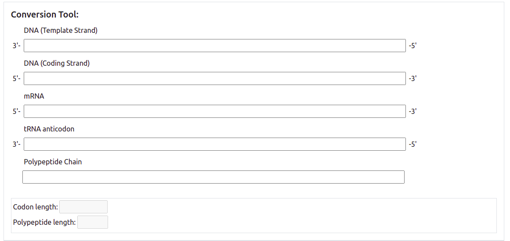

# TranscriptionAndTranslation
DNA string -> converter/calculator tool. Check it out on [github pages](http://williamzhou.me/TranscriptionAndTranslation/))!

## [TranscriptionAndTranslation](http://williamzhou.me/TranscriptionAndTranslation/)

Made possible using React:
-------

All image credits go to [Khan Academy](https://www.khanacademy.org/) and all formula sheet credits go to [Alberta Ed](https://www.alberta.ca/education.aspx).
